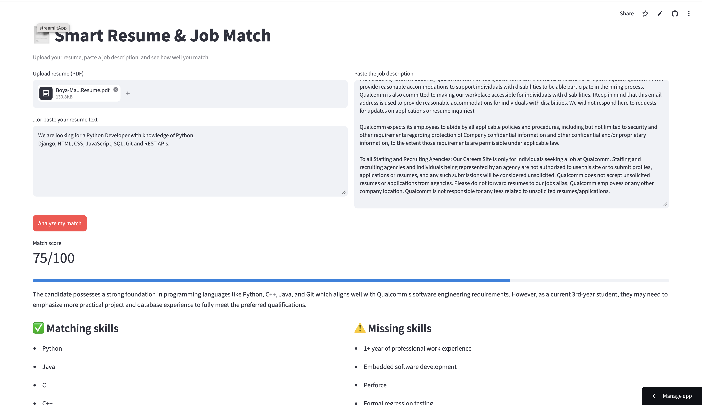

# 🤖 AI Resume Matcher

> An AI-powered web application that analyzes a resume against a job description and provides a match score, relevant skills, missing skills, and actionable improvement suggestions.

🌐 **Live Demo:** https://resume-matc.streamlit.app/

📂 **GitHub Repository:** https://github.com/boyamaniteja245-commits/resume-matcher

---

## 📸 Project Preview



---

## 📌 Overview

**AI Resume Matcher** is a web application built with **Python, Streamlit, and Google's Gemini API**.

The application allows users to upload their resume as a PDF and provide a job description. The AI analyzes both inputs and generates useful insights about how closely the candidate's resume matches the requirements of the job.

It is designed to help **students, freshers, and job seekers** quickly identify skill gaps and improve their resumes for specific job opportunities.

---

## ✨ Features

* 📄 Upload resumes in PDF format
* 📝 Paste a job description
* 🤖 AI-powered analysis using Google Gemini
* 🎯 Generate a resume-to-job match score
* 🛠️ Identify relevant skills
* ⚠️ Highlight missing or insufficient skills
* 💡 Provide resume improvement suggestions
* 📊 Present analysis in an easy-to-understand format
* 🌐 Interactive Streamlit web interface
* 🔐 Secure API key management using Streamlit Secrets
* 📱 Accessible through a public web application
* ⚡ Fast AI-powered resume analysis

---

## 🧠 How It Works

```text
                    USER
                      │
                      ▼
             Upload Resume PDF
                      │
                      ▼
             Enter Job Description
                      │
                      ▼
              Extract Resume Text
                      │
                      ▼
          Resume + Job Description
                      │
                      ▼
              Google Gemini API
                      │
                      ▼
                AI Analysis
                      │
          ┌───────────┼───────────┐
          ▼           ▼           ▼
      Match Score   Skills    Missing Skills
                      │
                      ▼
             Improvement Tips
```

---

## 🛠️ Tech Stack

| Technology           | Purpose                      |
| -------------------- | ---------------------------- |
| 🐍 Python            | Core application development |
| 🎈 Streamlit         | Web application framework    |
| 🤖 Google Gemini API | AI-powered resume analysis   |
| 📄 PDF Processing    | Resume text extraction       |
| 🔐 Streamlit Secrets | Secure API key management    |
| 🧰 Git & GitHub      | Version control and hosting  |

---

## 📂 Project Structure

```text
resume-matcher/
│
├── app.py
├── requirements.txt
├── README.md
└── .gitignore
```

### File Description

**`app.py`**
Main Streamlit application containing the resume upload, job description input, AI analysis, and result generation.

**`requirements.txt`**
Contains the Python dependencies required to run the application.

**`README.md`**
Project documentation and setup instructions.

**`.gitignore`**
Prevents unnecessary or sensitive files from being uploaded to GitHub.

---

## 🚀 Getting Started

Follow these steps to run the project locally.

### 1. Clone the repository

```bash
git clone https://github.com/boyamaniteja245-commits/resume-matcher.git
```

### 2. Open the project

```bash
cd resume-matcher
```

### 3. Create a virtual environment

```bash
python -m venv venv
```

Activate it on macOS/Linux:

```bash
source venv/bin/activate
```

On Windows:

```bash
venv\Scripts\activate
```

### 4. Install dependencies

```bash
pip install -r requirements.txt
```

### 5. Configure the Gemini API key

For local development, create:

```text
.streamlit/secrets.toml
```

Add your API key:

```toml
GEMINI_API_KEY = "your_api_key_here"
```

> ⚠️ **Never upload your API key or `secrets.toml` to GitHub.**

Make sure `.streamlit/secrets.toml` is included in your `.gitignore`.

### 6. Run the application

```bash
streamlit run app.py
```

The application will open in your browser.

---

## 🔐 API Key Security

This project uses **Streamlit Secrets** to protect the Gemini API key in the deployed application.

The API key should **never** be hard-coded directly into the source code or committed to GitHub.

Example:

```toml
GEMINI_API_KEY = "your_api_key_here"
```

Keep the actual key private.

---

## 📊 Example Workflow

### Step 1 — Upload Resume

Upload your resume in PDF format.

### Step 2 — Add Job Description

Paste the job description for the position you are interested in.

### Step 3 — Analyze

The application sends the relevant resume and job-description information to the Gemini-powered analysis workflow.

### Step 4 — Review Results

The application provides information such as:

* Match score
* Relevant skills
* Missing skills
* Skill alignment
* Resume improvement suggestions

---

## 🎯 Use Cases

This application can be useful for:

* 🎓 College students
* 👨‍💻 Freshers
* 💼 Job seekers
* 🔄 Career switchers
* 📄 Resume improvement
* 🎯 Job-specific resume preparation
* 🧑‍💼 Internship applications

---

## 🔮 Future Improvements

Possible future enhancements include:

* 📊 Visual match-score dashboard
* 📈 Skill-matching charts
* 📄 Resume improvement recommendations
* 🧠 More detailed job-role analysis
* 📑 Support for additional document formats
* 💬 AI-powered resume Q&A
* 📥 Downloadable analysis reports
* 🔎 Multiple job-description comparison
* 🎨 Improved UI and customization

---

## ⚠️ Disclaimer

The match score and recommendations are **AI-generated suggestions** and should not be treated as a definitive measure of a candidate's suitability for a job.

Users should review the generated results and make their own decisions when applying for jobs.

---

## 👨‍💻 Author

### Boya Mani Teja

**B.Tech CSE Student | Python Developer | Web Developer**

Interested in building practical applications using **Python, AI, and web technologies**.

### 🔗 Connect With Me

* 💻 GitHub: https://github.com/boyamaniteja245-commits
* 🔗 LinkedIn: https://www.linkedin.com/in/boya-maniteja-6b4320379/

---

## ⭐ Project

If you find this project useful, consider giving the repository a ⭐ on GitHub.

**Built with Python, Streamlit, and Google Gemini AI.** 🚀
